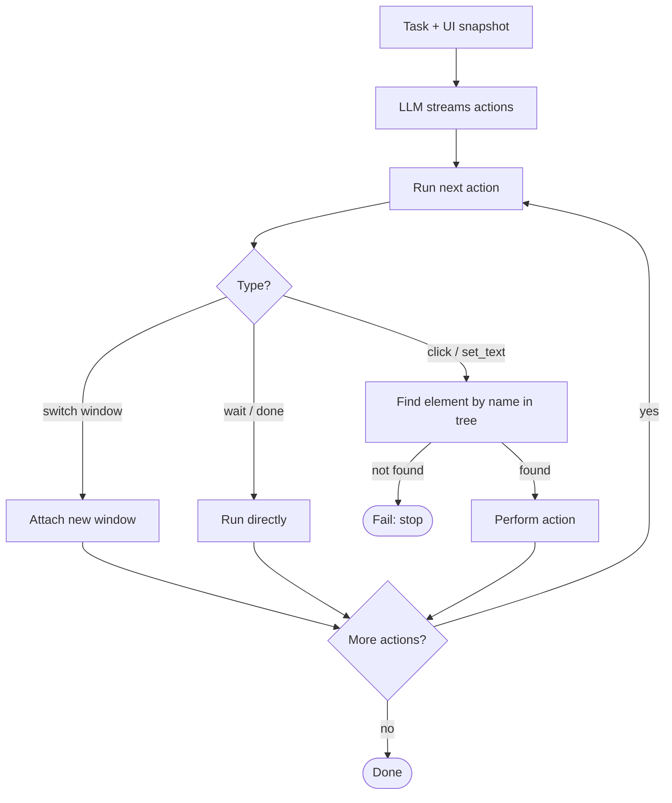

```mermaid
flowchart TD
    A["Task + UI snapshot"] --> B["LLM streams actions"]
    B --> C["Run next action"]
    C --> D{"Type?"}
    D -->|"switch window"| E["Attach new window"]
    D -->|"click / set_text"| F["Find element by name in tree"]
    D -->|"wait / done"| G["Run directly"]
    F -->|"not found"| X(["Fail: stop"])
    F -->|"found"| H["Perform action"]
    E --> I{"More actions?"}
    G --> I
    H --> I
    I -->|yes| C
    I -->|no| Z(["Done"])
```